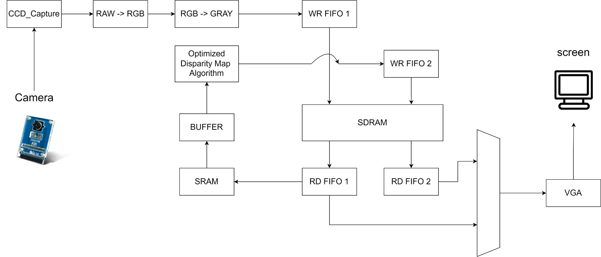
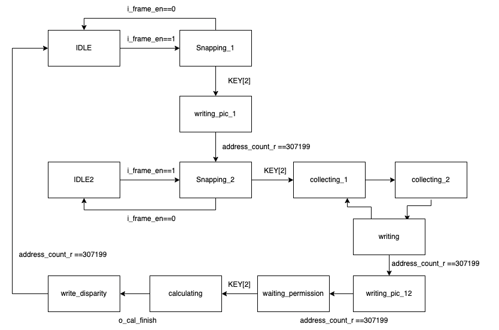

# Introduction
This is a FPGA disparity calculator. It consists of one FPGA, one camera, and one screen. To calculate disparity map, user has to use the camera take two picture with different angles. The first picture is saved into SD RAM, 

We reference [1] for algorithm and [2] for hardware structure. After some adjustments, we implemented it in RTL level, and follow the design flow below to tape-out and testing. 

# Algorithm
We adopted the proposed method in [1], and it consists of three parts:
#### 1. Sum of Absolute Difference (SAD) algorithm
The SAD algorithm is a correlation-based method with high computational efficiency. Given a pixel $(x,y)$ in left image and maximum value of user-defined maximum disparity $d_{max}$, and correlation index $Crl(x,y,s)$ is calculated for each displacement $S$ of the correlation window in right image by:


$$ Crl(x,y,s) = \sum_{u=-w,v=-w}^{u=w,v=-w}|I_l(x+u,u+v) - I_r(x+u+s,y+v)|$$


And for the pixel $(x,y)$, its disparity can be determined by 

<!-- $$ d(x,y) = argmin_s Crl(x,y,s) $$ -->
$$ d(x,y) = \mathop{\arg\min}_{s} Crl(x,y,s)$$


#### 2. Edge distance
To improve vanilla SAD algorithm, [1] used edge distance to calculate the disparity of pixel from smooth surface. The nearest left edge is calculated by: 

$$k(x,y) = |I_{\delta}(x,y)-I_{\delta}(x-1,y)|$$
$$distance(x,y) = \begin{cases}l=0 & \text{if }k(x,y)<\beta, \\
l=l+1 & \text{if }k(x,y)>\beta,  \end{cases}$$

where $\beta$ is the threshold value that defines an edge, and $\delta$ is $l$ or $r$.

#### 3. Homogeneity parameter 
A $\psi$ parameter corresponding to the homogeneity degree for each pixel of the left image is determined as following:

$$ h(x,y) = \sum_{u=-w,v=-w}^{u=w,v=-w}|I_l(x+u,u+v)|$$
$$\psi(x,y) = \begin{cases}0 & \text{if }h(x,y)/(w+1)^2 < \lambda, \\
1 & \text{if }h(x,y)/(w+1)^2 > \lambda.\end{cases}$$


#### 4. Composition
Finally, we use the $\psi$ to determine a final disprity map by assigning the values from the edge disparity map for points with uniorm texture and the values obtained from the disparity from points with uneven texture as following: 

$$disparity(x,y) = \begin{cases}distance(x,y) & \text{if }\psi(x,y) == 0, \\
d(x,y) & \text{if } \psi(x,y) == 1.\end{cases}$$


# Hardware Implementation

### Window buffer
To make sure 

# Reference
[1] A. Aguilar-González, M. Pérez-Patricio, M. Arias-Estrada, J. -L. Camas-Anzueto, H. -R. Hernández-de León and A. Sánchez-Alegría, "An FPGA Correlation-Edge Distance approach for disparity map," 2015 International Conference on Electronics, Communications and Computers (CONIELECOMP), Cholula, Mexico, 2015, pp. 21-28, doi: 10.1109/CONIELECOMP.2015.7086952. 

[2] Madaín Pérez Patricio, Abiel Aguilar-González, "FPGA implementation of an efficient similarity-based adaptive window algorithm for real-time stereo matching," J. Real Time Image Process. 16(2): 271-287 (2019)