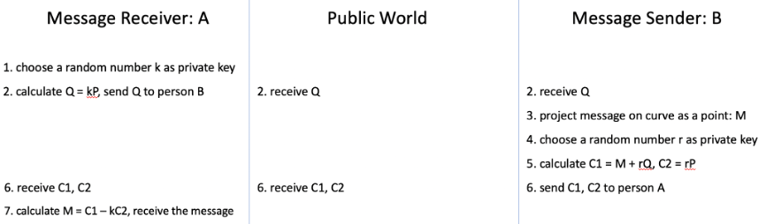

# Introduction
The aim of this project is to implement an accelerator for Elliptic Curve Crypotography(ECC), and go through all procedure of chip manufacturing. 

We reference [1] for hardware structure and [2] for algorithm. After some adjustments, we implemented it in RTL level, and follow the design flow below to tape-out and testing. 

# Background of Elliptic Curve Cryptography(ECC)
The chip design for this instance involves the use of a randomly selected constant 'k' to perform scalar multiplication on elliptic curves, resulting in the generation of the public key. 
Elliptic Curve Cryptography (ECC) is a public-key encryption algorithm based on elliptic curve mathematics. ECC's primary advantage is that, compared to the RSA encryption algorithm, it achieves a similar level of security with smaller key lengths.

The security of ECC encryption systems relies on the difficulty of reversing scalar multiplication. Assuming one party selects a number 'k' and a starting point 'P,' performs scalar multiplication to obtain 'kP,' and then transmits it, a third party would find it challenging to reverse the operation and obtain the values of 'k' or 'P' from 'kP.' The diagram below illustrates the interaction between the Message Receiver (A) and Message Sender (B), demonstrating the encryption effectiveness achieved during the information transmission process in the ECC system. It also highlights that even if a third party (Public World) intercepts the transmitted data, it is difficult to retrieve the original information.

<!-- In this chip, we accelerate the two most crucial operations in both ECC encryption and decryption - point operations and point doubling in polynomial basis over binary finite field $GF(2^m)$. In polynomial basis over $GF(2^m)$, we have to first set a polynomial basis. (e.g. $P(x) = p_mx^m+p_{m-1}x^{m-1}+...+p_1x^1+p_0$. Then all the numbers 
 -->

Below I list how we realize $GF(2^m)$ arithematics,

## Addition&Subtraction
* Bit-wise XOR with no carry-in and carry-out.
## Multipliction
#### $a*b$ 
* Same as ordinary multiplication, but no carry-in when doing addition.
#### $a^2$
* Insert zeros between each bit, for example: $a = 0111, a^2 = 0010101$ 
## Devision 
#### $a/b$
* We calculate $1/b$ by Itoh-Tsuji Algorithm and then conduct $a * 1/b$.
* Itoh-Tsuji Algorithm: 

## Modular polynomial
We adopt ECC-163 standard with polynomial basis $x^{163}+x^7+x^6+x^3+1$. For every number, it is 163-bit and its i-th bit reprsent x^i. If arithematic result exceeds 163 bits, the number has to mod the polynomial basis $x^{163}+x^7+x^6+x^3+1$.

# Hardware Implementation

# Place&Route Result

# Tape-out Spec

# Reference
[1] KASHIF, Muhammad; CICEK, Ihsan; IMRAN, Malik. A Hardware Efficient Elliptic Curve Accelerator for FPGA Based Cryptographic Applications. In: 2019 11th International Conference on Electrical and Electronics Engineering (ELECO). IEEE, 2019. p. 362-366.

[2] RODRÍGUEZ-HENRÍQUEZ, Francisco, et al. Parallel Itoh–Tsujii multiplicative inversion algorithm for a special class of trinomials. Designs, Codes and Cryptography, 2007, 45.1: 19-37.

[3] KARATSUBA, Anatolii. Multiplication of multidigit numbers on automata. In: Soviet physics doklady. 1963. p. 595-596. 	

