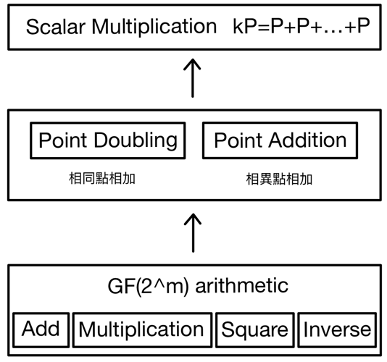
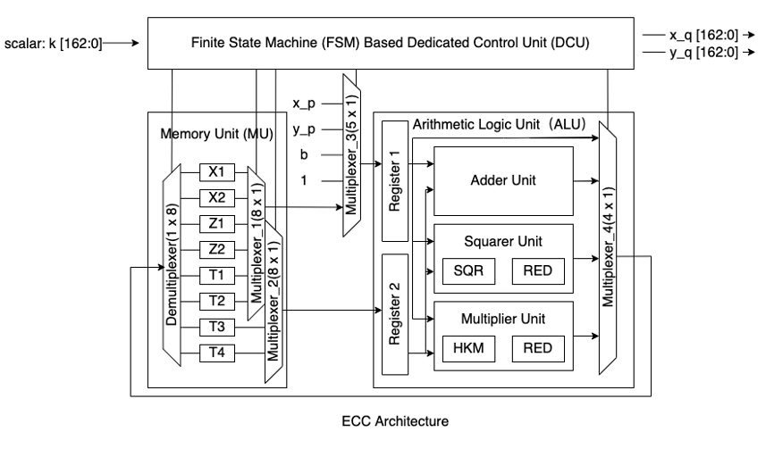
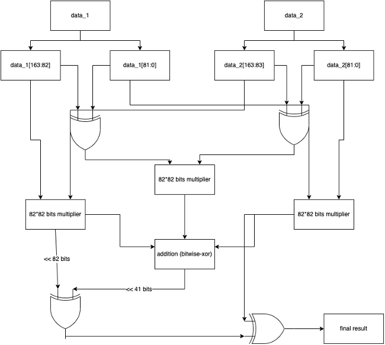
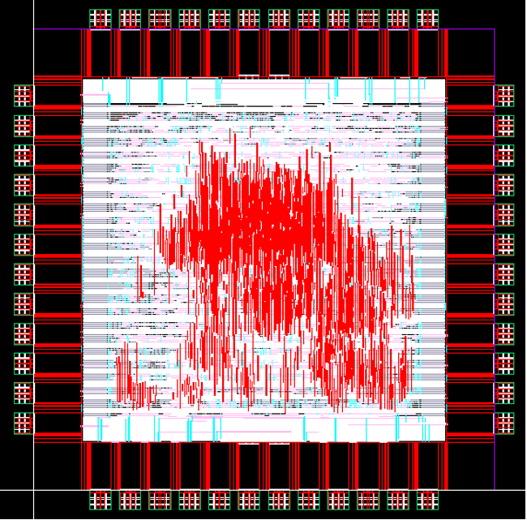
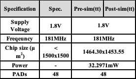

# Introduction
The aim of this project is to implement an accelerator for Elliptic Curve Crypotography(ECC), and go through all procedure of chip manufacturing. 

We reference [1] for hardware structure and [2] for algorithm. After some adjustments, we implemented it in RTL level, and follow the design flow below to tape-out and testing. 

# Background of Elliptic Curve Cryptography(ECC)
<!-- The chip design for this instance involves the use of a randomly selected constant 'k' to perform scalar multiplication on elliptic curves, resulting in the generation of the public key.  -->

Elliptic Curve Cryptography (ECC) is a public-key encryption algorithm based on elliptic curve mathematics. ECC's primary advantage is that, compared to the RSA encryption algorithm, it achieves a similar level of security with smaller key lengths.

The security of ECC encryption systems relies on the difficulty of reversing scalar multiplication. Assuming one party selects a number $k$ and a starting point $P$, performs scalar multiplication to obtain $kP$, and then transmits it, a third party would find it challenging to reverse the operation and obtain the values of $k$ or $P$ from $kP$. The diagram below illustrates the interaction between the Message Receiver (A) and Message Sender (B), demonstrating the encryption effectiveness achieved during the information transmission process in the ECC system. It also highlights that even if a third party (Public World) intercepts the transmitted data, it is difficult to retrieve the original information.
 system")

Below I list how we realize $GF(2^m)$ arithematics,

## Addition&Subtraction
* Bit-wise XOR with no carry-in and carry-out.
## Multipliction
#### $a*b$ 
* Same as ordinary multiplication, but no carry-in when doing addition.
#### $a^2$
* Insert zeros between each bit, for example: $a = 0111, a^2 = 0010101$ 
## Devision 
#### $a/b$
* We calculate $b^{-1}$ by Itoh-Tsuji Algorithm and Fermat's little theorem and then conduct $a * b^{-1}$.
* Fermat's little theorem: $$b \in GF(2^{163}), b^{-1} = b^{2^{163} -2} = b^{2^{1}} * b^{2^{2}} * ... * b^{2^{162}} $$
In this way, reciprocal computation can be accomplished through 161 multiplications and 162 square operations.
* Itoh-Tsuji Algorithm: To reduce the number of time-comsuming multiplications, we adopted Itoh-Tsuki Algorithm to achieve reciprocal computation by 9 multiplications and 162 square operations. This algorithm defines $\beta_k = a^{2^k-1}, k \in \mathbb{N}$. 
$$\forall k,j \in 	\mathbb{N}, \beta_{k+j} = \beta_{k}^{2^j} * \beta_j.$$ Through this property, the number of multiplication operations can be reduced using an addition chain of length $t$. Define the addition chain $U = (u_0, u_1, u_2, ..., u_t)$, where $u_0 = 1, u_t = m-1.$ 
The related sequence $V = ((k_1, j_1), (k_2, j_2), ..., (k_t, j_t))$, where $u_i = u_{k_i} + u_{j_i}.$ We use addition $U = (1,2,4,8,16,32,64,80,81,162)$, and $V = ((0,0),(1,1),(2,2),(3,3),(4,4),(5,5),(6,4),(7,0),(8,8))$

## Modular polynomial
Since the results of multiplication and square operation will exceed 163 bits, the results need to be modulo by the polynomial basis $x^{163}+x^7+x^6+x^3+1$. 
$$c_162 = s_162 +s_318+ s_319+s_322$$
$$c_i = s_i + s_{163+i} + s_{156_i}+ s_{157+i} + s_{160+i}, 13 \leq i \leq 161$$
$$c_j = s_j + s_{163+j} + s_{156+j} + s_{157+j} + s_{160+j} + s_{312+j}, 11 \leq j \leq 12$$
$$c_k = s_k + s_{163+k} + s_{156+k} + s+{157+k} + s_{160+k} + s_{312+k} + s_{314+k}, 7 \leq k \leq 10$$
$$c+6 = s_6 + s_169 + s_163 + s_166 + s_322 + s_319 + s_320$$
$$c_m = s_m + s_{163+m} + s_{160+m}+ s_{319+m} + s_{316+m} + s_{317+m}, 3 \leq m \leq 5$$
$$c_2 = s_2 + s_165 + s_321 + s_322$$
$$c_n = s_n + s_{163+n} + s_{319+n} + s_{320+n} + s_{323_n}, 0 \leq n \leq 1 

# Hardware Implementation
The design of this chip emulates a simple SISD CPU structure. The control module regulates this process by providing signals to MUX and deMUX. The execution is divided into three main parts: Read Memory, Execute, and Write Back. Considering the hazards arising from reading and writing to the same memory and the critical path during calculations, the architecture adds additional registers before data enters the arithmetic module. This design aims to prevent conflicts and reduce the critical path length.

The memory is designed with eight registers as the maximum memory capacity. The maximum memory requirements are eight in total, composed of X1, X2, Z1, Z2 representing initial point information, and additional results T1, T2, T3, T4 needed during the computation process. The maximum additional memory demand arises from the reciprocal calculation, requiring three extra memory units for each reciprocal operation. Consequently, after analyzing the most resource-intensive part of the algorithm, we decided to use eight registers in the memory unit.

# Place&Route Result

# Layout Verification

The layout verification (DRC) should be run on TSRI’s queue server under their tape-out protocol.

The LVS test can be run locally by Calibre.

# Tape-out Spec

# Reference
[1] KASHIF, Muhammad; CICEK, Ihsan; IMRAN, Malik. A Hardware Efficient Elliptic Curve Accelerator for FPGA Based Cryptographic Applications. In: 2019 11th International Conference on Electrical and Electronics Engineering (ELECO). IEEE, 2019. p. 362-366.

[2] RODRÍGUEZ-HENRÍQUEZ, Francisco, et al. Parallel Itoh–Tsujii multiplicative inversion algorithm for a special class of trinomials. Designs, Codes and Cryptography, 2007, 45.1: 19-37.

[3] KARATSUBA, Anatolii. Multiplication of multidigit numbers on automata. In: Soviet physics doklady. 1963. p. 595-596. 	

