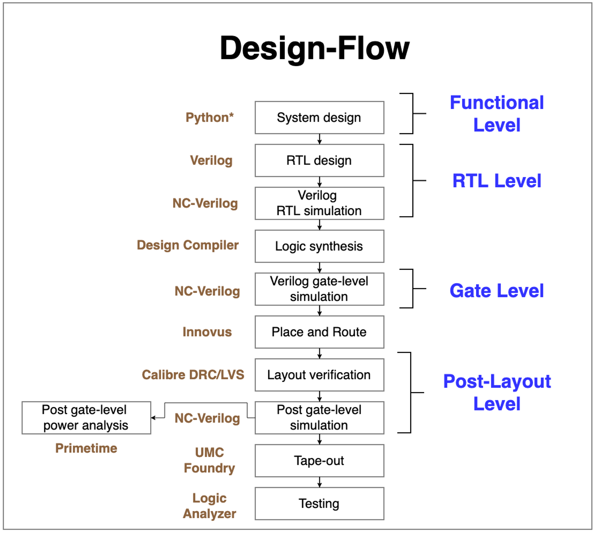

# Introduction
The aim of this project is to implement an accelerator for Elliptic Curve Crypotography(ECC), and go through all procedure of chip manufacturing. 

We reference [1] for hardware structure and [2] for algorithm. After some adjustments, we implemented it in RTL level, and follow the design flow below to tape-out and testing. 

# Backgroun of ECC & $GF(2^m)$
In this chip, we accelerate the two most crucial operations in both ECC encryption and decryption - point operations and point doubling over binary finite field $GF(2^m)$. Below I list how we realize $GF(2^m)$ arithematics,

## Addition&Subtraction
* Bit-wise XOR with no carry-in and carry-out.
## Multipliction
#### a*b 
* Same as ordinary multiplication, but no carry-in when doing addition.
#### a^2
* Insert zero between each bit, for example: $P = 0111, 2P = 0010101$ 
## Devision 
#### a/b
* We calculate 1/b by Itoh-Tsuji Algorithm and then conduct a * 1/b.

## Modular polynomial
We adopt ECC-163 standard with polynomial basis $x^163+x^7+x^6+x^3+1$. For every number, it is 163-bit and its i-th bit reprsent x^i. If arithematic result exceeds 163 bits, the number has to mod the polynomial basis $x^163+x^7+x^6+x^3+1$.

# Hardware Implementation

# Place&Route Result

# Tape-out Spec

# Reference

