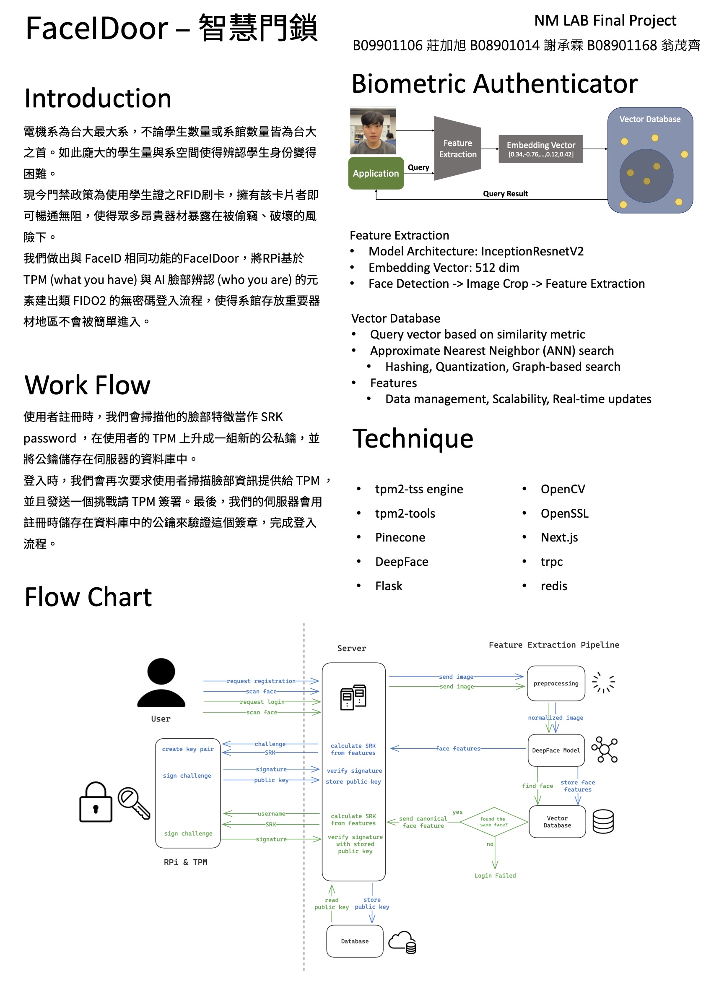

This is the final project of NTUEE Network & Multimedia Laboratory (EE-3002).
In collaboration with H.L. Hsieh, C.C. Hsu.

## Introduction
In this project, we demo a prototype of MFA Doorlock with RPi, Trust Platform Module(TPM), DeepFace Model, and Vector Database. 

[Quick Demo](https://youtu.be/CD8uWzFCUa4) [Presentation - Mandarin](https://youtu.be/2mjUE9uJjco)

## Sign up
First, users will be asked to take a picture for face recognition. After a few image processing, the image will go through InceptionResnetV2 model and become an 512-dim embedding vector.
This vector will then be used as SRK password and generate a key pair in user's TPM. The public key will be sent to vector database.
## Sign in
When signing up, users will be asked to provide face information to the feature extraction pipeline, and the resulting 512-dim embedding vector would be sent to vector database to query with approximate nearst neighbbor (ANN) searching.

