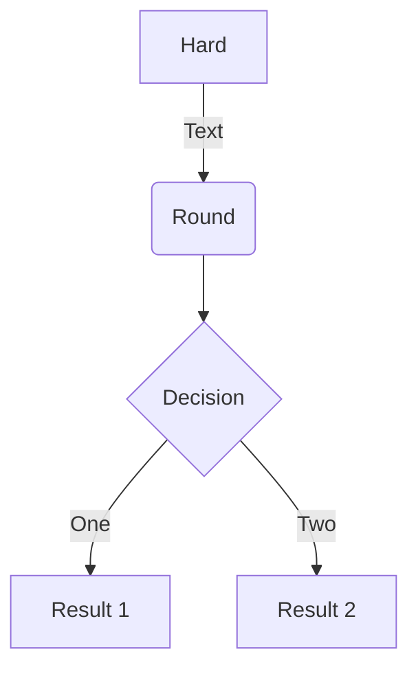
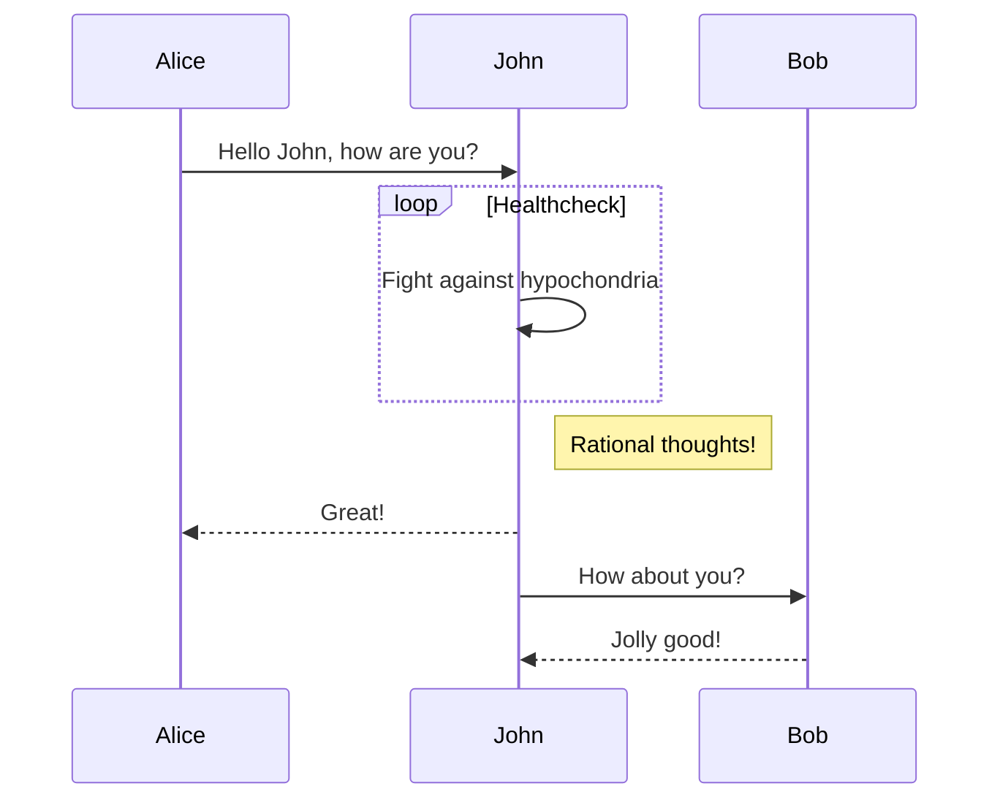
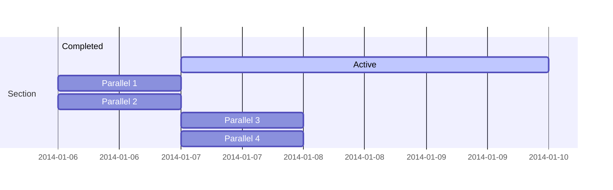
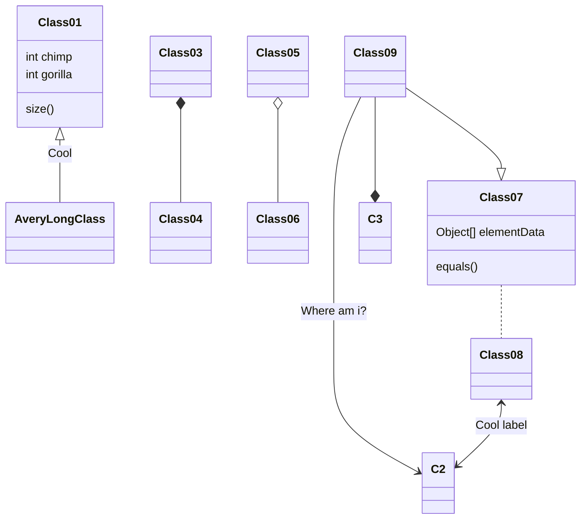
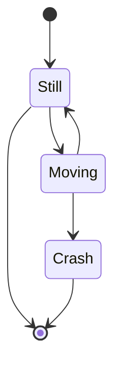

<!-- ### Introduction 
Vision transformer (ViT) and its variants have demonstrated great potential in various computer vision tasks. We introduce Fisher information (FI) from tokens to evaluate token importance across different transformer blocks and propose a Retraining-free Constraint-aware Token Pruning (RCTP) framework. RCTP employs a two-step process to obtain the optimal pruning thresholds without retraining under different FLOPs constraints. In the first step, a candidate threshold table and a FLOPs-Fisher table are constructed through a three-stage pipeline to record the trade-off between FLOPs and FI loss of each candidate threshold. In the second step, a modified Viterbi algorithm determines optimal threshold sets with minimum overall FI loss under different FLOPs-constraints in one shot. Our experiment illustrates that RCTP attains better accuracy-FLOPs trade-off than prior pruning-based approaches. -->


### Introduction
Vision Transformer (ViT) [1] has demonstrated remarkable performance in various computer vision tasks. However, its computational complexity has posed a significant challenge when it comes to deploying it on resource-constrained edge devices. In response to this challenge, token pruning has been a promising research area to address this problem, since ViT exhibits quadratic computation costs with the number of tokens.

Within the realm of token pruning, two main branches have emerged: pruning-based methods and merging-based methods. The former reduces tokens by discarding unimportant tokens, while the latter reduces tokens by merging similar ones. In terms of edge devices, merging-based methods like ToMe [2] need additional hardware to support operations like argsort and token similarity calculations, making them less ideal for edge devices with limited hardware resources.

Given the limitation of edge devices, we opt for pruning- based approaches in this work. Pruning-based methods can be further divided into retraining-based methods and retraining-free ones. Retraining-based methods like learnable token pruning [3] [4] use learned modules to make token pruning decisions. They can be constraint-aware but necessitate a repetitive retraining process when the constraint changes. On the other hand, ATS [5], a retraining-free method, adaptively prunes tokens by sampling over the inverse cumulative distribution function (CDF) of class attention scores. However, it requires manual adjustment of sampling time to meet varying FLOPs constraints.

In this work, we propose Retraining-free Constraint-aware Token Pruning (RCTP) to address these issues. Our approach utilizes Fisher information (FI) to estimate the information loss of candidate thresholds in each transformer block. Subsequently, our modified Viterbi algorithm [6] determines threshold sets with minimum FI loss suitable for specific FLOPs constraints.
### Methodology
#### Overview:

# Step1: Construction of Candidate threshold table and FLOPs-Fisher table
In the first stage, given a sample dataset D, we collect the class attention scores and the FI of |D| × (N − 1) non- class tokens for each transformer block, where |D| is the number of samples in dataset D and N is the number of tokens. Since we apply our threshold pruning modules between MSA and MLP modules, we obtain the FI from the output of MSA modules. We empirically find that the FI of tokens descends exponentially from shallow layers to deep layers, which leads to an ineffective assessment of token importance between blocks. Therefore, we normalize the FI block-wisely.

In the second stage, we select M candidate thresholds within each transformer block to construct a candidate threshold table with a size of L × M . For simplicity, we expect these M candidate thresholds to be evenly distributed across the domain of FLOPs reduction ratio. Ideally, the m-th candidate threshold in l-th block, denoted as $$θ_l,m$$ , can approximately reduce FLOPs count by a fraction of m/M in the block. $θl,m$ is obtained by a two-step process. First, based on the number of tokens n and the embedding dimension d, the FLOPs count of a transformer block φ_BLK can be calculated as :

$$\phi_{BLK}(n, d) = 12 n d^2 + 2 n^2 d.$$


$$\phi_{BLK}(\frac{k}{|D| \times N}, d) = \frac{m}{M} \times \phi_{BLK}(N, d).$$

## Step2: Searching for optimal threshold set under a specific FLOPs constraint
### Experience Result

## Ablation Study

## Reference


### Mindmaps

Wowchemy supports a Markdown extension for mindmaps.

Simply insert a Markdown `markmap` code block and optionally set the height of the mindmap as shown in the example below.

A simple mindmap defined as a Markdown list:

<div class="highlight">
<pre class="chroma">
<code>
```markmap {height="200px"}
- Hugo Modules
  - wowchemy
  - blox-plugins-netlify
  - blox-plugins-netlify-cms
  - blox-plugins-reveal
```
</code>
</pre>
</div>

renders as

```markmap {height="200px"}
- Hugo Modules
  - wowchemy
  - blox-plugins-netlify
  - blox-plugins-netlify-cms
  - blox-plugins-reveal
```

A more advanced mindmap with formatting, code blocks, and math:

<div class="highlight">
<pre class="chroma">
<code>
```markmap
- Mindmaps
  - Links
    - [Wowchemy Docs](https://docs.hugoblox.com/)
    - [Discord Community](https://discord.gg/z8wNYzb)
    - [GitHub](https://github.com/HugoBlox/hugo-blox-builder)
  - Features
    - Markdown formatting
    - **inline** ~~text~~ *styles*
    - multiline
      text
    - `inline code`
    -
      ```js
      console.log('hello');
      console.log('code block');
      ```
    - Math: $x = {-b \pm \sqrt{b^2-4ac} \over 2a}$
```
</code>
</pre>
</div>

renders as

```markmap
- Mindmaps
  - Links
    - [Wowchemy Docs](https://docs.hugoblox.com/)
    - [Discord Community](https://discord.gg/z8wNYzb)
    - [GitHub](https://github.com/HugoBlox/hugo-blox-builder)
  - Features
    - Markdown formatting
    - **inline** ~~text~~ *styles*
    - multiline
      text
    - `inline code`
    -
      ```js
      console.log('hello');
      console.log('code block');
      ```
    - Math: $x = {-b \pm \sqrt{b^2-4ac} \over 2a}$
```

### Charts

Wowchemy supports the popular [Plotly](https://plot.ly/) format for interactive charts.

Save your Plotly JSON in your page folder, for example `line-chart.json`, and then add the `` shortcode where you would like the chart to appear.

Demo:



You might also find the [Plotly JSON Editor](http://plotly-json-editor.getforge.io/) useful.

### Math

Wowchemy supports a Markdown extension for $\LaTeX$ math. You can enable this feature by toggling the `math` option in your `config/_default/params.yaml` file.

To render _inline_ or _block_ math, wrap your LaTeX math with `$...$` or `$$...$$`, respectively. (We wrap the LaTeX math in the Wowchemy _math_ shortcode to prevent Hugo rendering our math as Markdown. The _math_ shortcode is new in v5.5-dev.)

Example **math block**:

```latex

$$
\gamma_{n} = \frac{ \left | \left (\mathbf x_{n} - \mathbf x_{n-1} \right )^T \left [\nabla F (\mathbf x_{n}) - \nabla F (\mathbf x_{n-1}) \right ] \right |}{\left \|\nabla F(\mathbf{x}_{n}) - \nabla F(\mathbf{x}_{n-1}) \right \|^2}
$$

```

renders as


$$\gamma_{n} = \frac{ \left | \left (\mathbf x_{n} - \mathbf x_{n-1} \right )^T \left [\nabla F (\mathbf x_{n}) - \nabla F (\mathbf x_{n-1}) \right ] \right |}{\left \|\nabla F(\mathbf{x}_{n}) - \nabla F(\mathbf{x}_{n-1}) \right \|^2}$$


Example **inline math** `$\nabla F(\mathbf{x}_{n})$` renders as $\nabla F(\mathbf{x}_{n})$.

Example **multi-line math** using the math linebreak (`\\`):

```latex

$$f(k;p_{0}^{*}) = \begin{cases}p_{0}^{*} & \text{if }k=1, \\
1-p_{0}^{*} & \text{if }k=0.\end{cases}$$

```

renders as



$$
f(k;p_{0}^{*}) = \begin{cases}p_{0}^{*} & \text{if }k=1, \\
1-p_{0}^{*} & \text{if }k=0.\end{cases}
$$



### Diagrams

Wowchemy supports a Markdown extension for diagrams. You can enable this feature by toggling the `diagram` option in your `config/_default/params.toml` file or by adding `diagram: true` to your page front matter.

An example **flowchart**:

    ```mermaid
    graph TD
    A[Hard] -->|Text| B(Round)
    B --> C{Decision}
    C -->|One| D[Result 1]
    C -->|Two| E[Result 2]
    ```

renders as



An example **sequence diagram**:

    ```mermaid
    sequenceDiagram
    Alice->>John: Hello John, how are you?
    loop Healthcheck
        John->>John: Fight against hypochondria
    end
    Note right of John: Rational thoughts!
    John-->>Alice: Great!
    John->>Bob: How about you?
    Bob-->>John: Jolly good!
    ```

renders as



An example **Gantt diagram**:

    ```mermaid
    gantt
    section Section
    Completed :done,    des1, 2014-01-06,2014-01-08
    Active        :active,  des2, 2014-01-07, 3d
    Parallel 1   :         des3, after des1, 1d
    Parallel 2   :         des4, after des1, 1d
    Parallel 3   :         des5, after des3, 1d
    Parallel 4   :         des6, after des4, 1d
    ```

renders as



An example **class diagram**:

    ```mermaid
    classDiagram
    Class01 <|-- AveryLongClass : Cool
    Class03 *-- Class04
    Class05 o-- Class06
    Class07 .. Class08
    Class09 --> C2 : Where am i?
    Class09 --* C3
    Class09 --|> Class07
    Class07 : equals()
    Class07 : Object[] elementData
    Class01 : size()
    Class01 : int chimp
    Class01 : int gorilla
    Class08 <--> C2: Cool label
    ```

renders as



An example **state diagram**:

    ```mermaid
    stateDiagram
    [*] --> Still
    Still --> [*]
    Still --> Moving
    Moving --> Still
    Moving --> Crash
    Crash --> [*]
    ```

renders as



### Todo lists

You can even write your todo lists in Markdown too:

```markdown
- [x] Write math example
  - [x] Write diagram example
- [ ] Do something else
```

renders as

- [x] Write math example
  - [x] Write diagram example
- [ ] Do something else

### Tables

Save your spreadsheet as a CSV file in your page's folder and then render it by adding the _Table_ shortcode to your page:

```go

```

renders as



### Callouts

Academic supports a [shortcode for callouts](https://docs.hugoblox.com/content/writing-markdown-latex/#callouts), also referred to as _asides_, _hints_, or _alerts_. By wrapping a paragraph in `{} ... {}`, it will render as an aside.

```markdown
{}
A Markdown aside is useful for displaying notices, hints, or definitions to your readers.
{}
```

renders as

{}
A Markdown aside is useful for displaying notices, hints, or definitions to your readers.
{}

### Spoilers

Add a spoiler to a page to reveal text, such as an answer to a question, after a button is clicked.

```markdown

You found me!

```

renders as

 You found me! 

### Icons

Academic enables you to use a wide range of [icons from _Font Awesome_ and _Academicons_](https://docs.hugoblox.com/getting-started/page-builder/#icons) in addition to [emojis](https://docs.hugoblox.com/content/writing-markdown-latex/#emojis).

Here are some examples using the `icon` shortcode to render icons:

```markdown
 Terminal  
 Python  
 R
```

renders as

 Terminal  
 Python  
 R

### Did you find this page helpful? Consider sharing it 🙌
